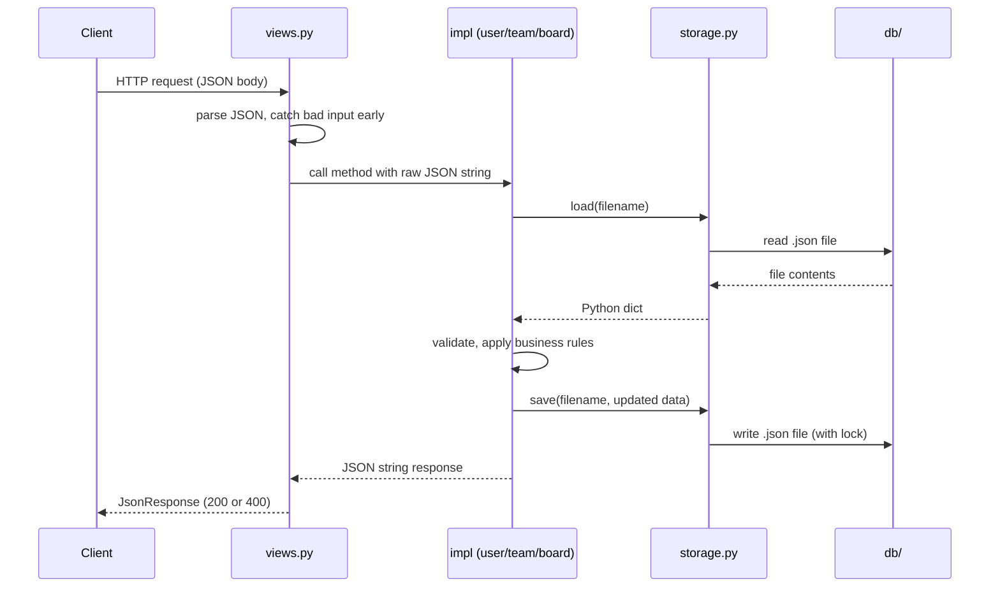

# Team Project Planner

## What This Is ?

A Django backend that lets you manage users, teams, and project boards through simple JSON APIs. Data is stored in local JSON files so no database setup is needed.

---

## My Approach To The Problem

The first thing I noticed was that the base classes already defined the full contract : the method names, the input shapes, output shapes, and constraints. So i just had to implement that contract cleanly, and not design the API from scratch.

I made three main decisions:

**1. JSON files for storage, no use of Database (SQLite/MySQL).**
The problem statement given mentioned "local file storage."
I could have used SQLite which (Django sets it up by default), but that felt like going against the requirement. JSON files are also easy to open and inspect, which is easier for debugging purposes.

**2. Using Plain Django views, and no Django REST Framework (DRF).**
DRF is great but it adds a lot of layers : serializers, viewsets, routers. For an API of this size, a simple class-based view that reads `request.body` and returns `JsonResponse` is easier to read and trace.
I kept a small `JSONAPIView` base class to avoid repeating the try/except and JSON parsing in every view.

**3. One storage helper, which is used everywhere.**
Rather than each impl (implementation) class doing its own file reading and writing, I added a single `JSONStorage` class in `storage.py`. It handles the file path, JSON parsing, and a threading lock so two requests don't corrupt the same file at the same time. Every impl class calls `storage.load()` and `storage.save()` : nothing else touches the files directly.

---

## Project Structure 

```
Root/
├── config/                 # Django settings and root URL config
├── project/
│   ├── impl/
│   │   ├── user_impl.py    # Concrete UserBase implementation
│   │   ├── team_impl.py    # Concrete TeamBase implementation
│   │   └── board_impl.py   # Concrete ProjectBoardBase implementation
│   ├── storage.py          # JSON file read/write helper
│   ├── views.py            # HTTP layer : reads request, calls impl, returns response
│   └── urls.py             # Route definitions
├── db/                     # JSON files created at runtime (not in zip)
├── out/                    # Exported board .txt files
├── user_base.py            # Given : not modified
├── team_base.py            # Given : not modified
├── project_board_base.py   # Given : not modified
├── test_api.py             # End-to-end smoke test
└── requirements.txt
```

---

## Request Flow



---

## Setup & Run

```bash
pip install -r requirements.txt
python manage.py runserver
```

Run the automated test suite (server must be running):

```bash
python test_api.py
```

Or walk through the full flow manually using curl (IDs from each response feed into the next step):

**1. Create a user**
```bash
curl -s -X POST http://127.0.0.1:8000/api/users/ \
  -H "Content-Type: application/json" \
  -d '{"name": "alice", "display_name": "Alice Smith"}'
```
```json
{"id": "a3f9c1d2-..."}
```

**2. Create a team (use user id as admin)**
```bash
curl -s -X POST http://127.0.0.1:8000/api/teams/ \
  -H "Content-Type: application/json" \
  -d '{"name": "Alpha Team", "description": "Our first team", "admin": "<user_id>"}'
```
```json
{"id": "b7e2a1f4-..."}
```

**3. Create a board (use team id)**
```bash
curl -s -X POST http://127.0.0.1:8000/api/boards/ \
  -H "Content-Type: application/json" \
  -d '{"name": "Sprint 1", "description": "First sprint", "team_id": "<team_id>", "creation_time": "2024-01-01T10:00:00"}'
```
```json
{"id": "c9d4b2e6-..."}
```

**4. Add a task to the board (use board id and user id)**
```bash
curl -s -X POST http://127.0.0.1:8000/api/tasks/ \
  -H "Content-Type: application/json" \
  -d '{"board_id": "<board_id>", "title": "Build login page", "description": "Create the login UI", "user_id": "<user_id>", "creation_time": "2024-01-01T10:00:00"}'
```
```json
{"id": "d1f6c3a8-..."}
```

**5. Mark the task as complete (use task id)**
```bash
curl -s -X PUT http://127.0.0.1:8000/api/tasks/status/ \
  -H "Content-Type: application/json" \
  -d '{"id": "<task_id>", "status": "COMPLETE"}'
```

**6. Close the board (use board id)**
```bash
curl -s -X POST http://127.0.0.1:8000/api/boards/<board_id>/ \
  -H "Content-Type: application/json" \
  -d '{"action": "close"}'
```

**7. Export the board : creates a txt file in out/**
```bash
curl -s -X POST http://127.0.0.1:8000/api/boards/<board_id>/export/ \
  -H "Content-Type: application/json" \
  -d '{"id": "<board_id>"}'
```
```json
{"out_file": "board_c9d4b2e6-....txt"}
```

```bash
cat out/board_<board_id>.txt
```

At each step the `db/` folder will have `users.json`, `teams.json`, and `boards.json` created. 
The `out/` folder will have the exported report after step 7.

## API Reference

All routes are under `/api/`.

| Method | Endpoint | What it does |
|--------|----------|--------------|
| GET | `/api/users/` | List all users |
| POST | `/api/users/` | Create a user |
| GET | `/api/users/<id>/` | Get user details |
| PUT | `/api/users/<id>/` | Update display name |
| GET | `/api/users/<id>/teams/` | Teams the user belongs to |
| GET | `/api/teams/` | List all teams |
| POST | `/api/teams/` | Create a team |
| GET | `/api/teams/<id>/` | Get team details |
| PUT | `/api/teams/<id>/` | Update team |
| POST | `/api/teams/<id>/members/` | Add users to team |
| DELETE | `/api/teams/<id>/members/` | Remove users from team |
| GET | `/api/teams/<id>/users/` | List members of a team |
| POST | `/api/boards/` | Create a board |
| GET | `/api/boards/?team_id=<id>` | List open boards for a team |
| POST | `/api/boards/<id>/` | Close a board (body: `{"action":"close"}`) |
| POST | `/api/boards/<id>/export/` | Export board report to `out/` |
| POST | `/api/tasks/` | Add a task to a board |
| PUT | `/api/tasks/status/` | Update task status |

---

## Assumptions I Made

A few things weren't mentioned in the ProblemStatement file, so here's what I decided:

- add_task needs a board_id : the docstring didn't include it but a task obviously has to belong to some board. Added it as a required field.
- list_boards only returns OPEN boards : the method docstring literally says "list all open boards for a team" so that was straightforward.
- User name can't be changed : the spec says so, so update_user just ignores the name field if someone passes it. No error, just silently skips it.
- Can't remove the admin from a team : the spec didn't say what to do here. A team without an admin felt wrong so I raise an error. Felt like the safer call.
- IDs are UUID4 : the spec just says <user_id>, <board_id> etc. with no format given. UUID4 needs zero setup and won't collide.

## End Note

Thank you for the opportunity. I enjoyed building and look forward to your feedback!
